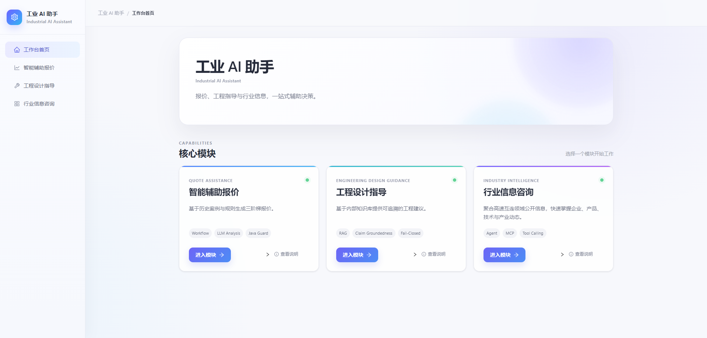
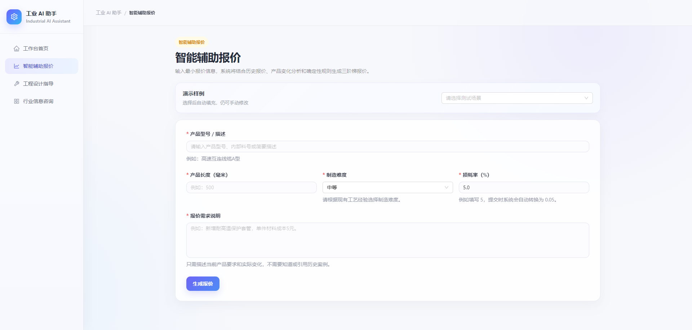
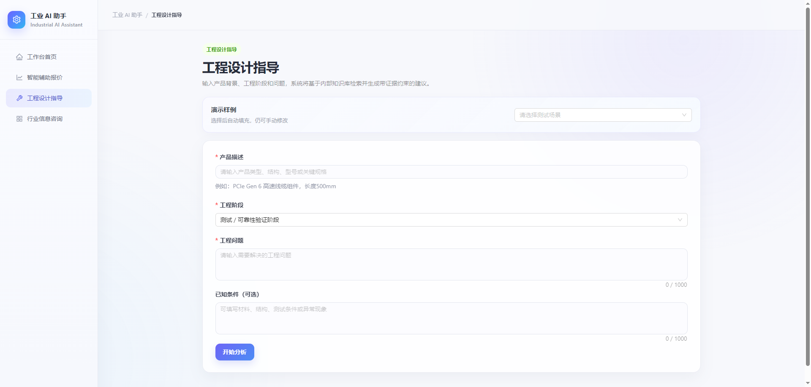
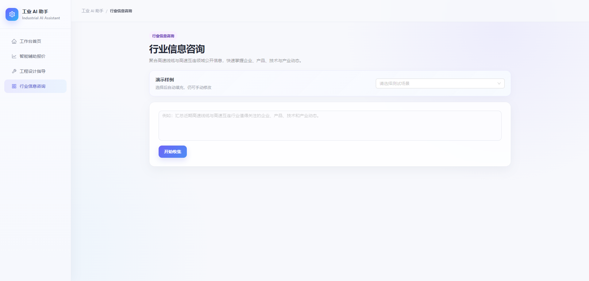
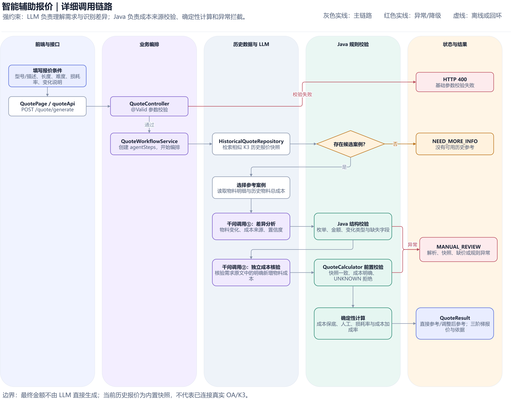
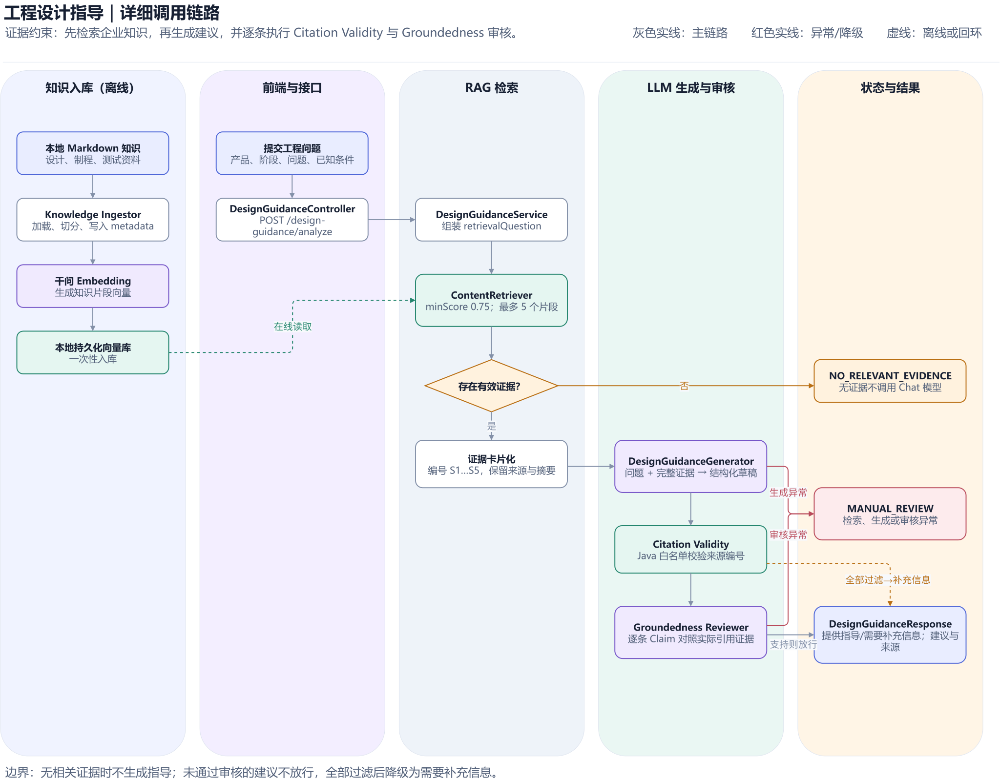
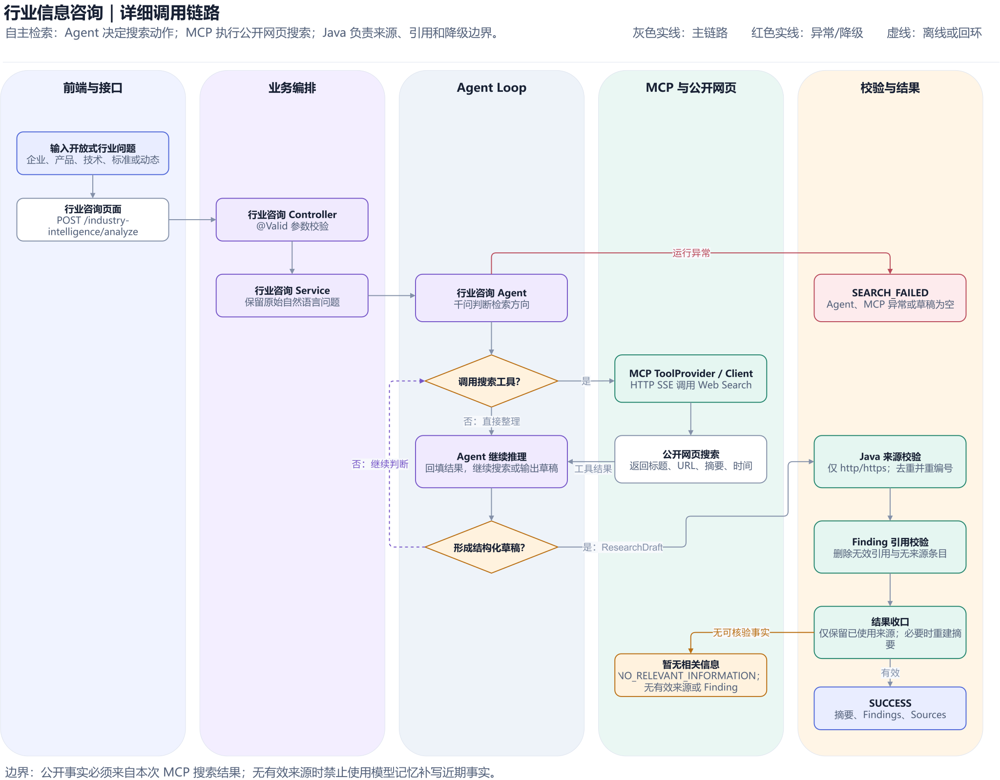

# 工业AI助手（Industrial AI Assistant）

面向高速线束制造场景的工业 AI 助手 MVP，通过智能辅助报价、工程设计指导和行业信息咨询三个模块，验证 LLM、RAG、MCP 与确定性业务规则在工业业务中的组合应用。

> 本项目为MVP，重点展示需求分析、AI 能力选型、业务编排、安全边界与端到端实现，不以替代企业现有 ERP、K3 或工程审批系统为目标。

## 项目展示



| 智能辅助报价 | 工程设计指导 | 行业信息咨询 |
| --- | --- | --- |
|  |  |  |

## 业务背景

高速线束产品种类多、型号差异细，报价、工程经验复用和外部信息检索高度依赖人工。项目围绕三个典型问题构建差异化 AI 链路：

| 业务模块 | 主要问题 | AI 定位 | 输出边界 |
| --- | --- | --- | --- |
| 智能辅助报价 | 历史案例查找慢、物料差异依赖经验、报价时限紧 | LLM 识别需求差异，Java 执行确定性计算 | 成本依据不完整时转人工复核，不由模型直接生成最终金额 |
| 工程设计指导 | 工程资料分散、经验复用率低、排查路径不统一 | RAG 检索企业知识，LLM 生成带证据的指导建议 | 无有效证据或引用审核失败时停止输出确定性建议 |
| 行业信息咨询 | 产品规范、物料趋势和行业动态检索耗时 | Agent 通过 MCP 调用公开信息检索工具 | 近期事实必须有公开来源，工具异常时明确降级 |

## 核心功能

### 1. 智能辅助报价

- 根据产品型号、长度、制造难度、损耗率和需求描述检索历史报价案例。
- 使用 LLM 对历史物料与当前需求进行逐项差异识别。
- 由 Java 按固定规则计算 `10PCS`、`1K`、`5K` 三档报价。
- 支持直接参考、调整后参考、需要补充信息和人工复核等决策分支。
- 对历史成本不一致、新增物料缺价等情况拒绝自动报价。

### 2. 工程设计指导

- 读取本地工程知识文档并完成文本切分、Metadata 标记和向量化。
- 根据产品、问题描述和已知现象召回相关知识片段。
- 生成包含排查顺序、操作建议、风险提示和证据来源的工程建议。
- 对 Citation Validity 与 Claim Groundedness 进行二次审核。
- 检索无证据或审核失败时返回安全降级结果。

### 3. 行业信息咨询

- 接收产品规范、原材料趋势和行业动态等开放式问题。
- 由 Agent 判断是否调用 MCP Web Search 工具。
- 汇总公开信息并保留来源，避免使用模型记忆补写近期事实。
- 对工具超时、无有效来源和信息不足等情况进行明确降级。

## AI 与业务规则的职责边界

```text
LLM：需求理解、差异识别、内容归纳与建议生成
RAG：检索企业知识、提供可追溯证据
MCP：连接外部实时信息与工具
Java：参数校验、业务规则、金额计算和安全门控
人工：处理缺价、证据冲突和高风险决策
```

项目不让 LLM 直接控制最终金额，也不在缺少证据时强行输出结论。AI 负责处理模糊语义，确定性代码负责约束业务结果。

## 模块详细调用链

<details>
<summary><strong>查看智能辅助报价详细调用链</strong></summary>

<br>



</details>

<details>
<summary><strong>查看工程设计指导详细调用链</strong></summary>
<br>



</details>

<details>
<summary><strong>查看行业信息咨询详细调用链</strong></summary>

<br>



</details>

## 技术栈

| 分类 | 技术 |
| --- | --- |
| 后端 | Java 21、Spring Boot 4.1、Spring MVC、Maven |
| AI 应用 | LangChain4j、千问 `qwen3.5-plus`、DashScope Embedding |
| RAG | 文档切分、Metadata、`text-embedding-v2`、本地持久化向量库 |
| Agent 与工具 | Tool Calling、MCP Web Search、业务编排与降级机制 |
| 前端 | React 19、Vite 8、Ant Design 6、Axios |
| 测试 | JUnit 5、单元测试、隔离的集成测试 |

## 项目结构

```text
industrial-ai-assistant/
├── frontend/                         # React 前端
├── src/main/java/com/cetus/industrialai/
│   ├── quote/                        # 智能辅助报价
│   ├── designguidance/               # 工程设计指导
│   ├── industryintelligence/         # 行业信息咨询
│   ├── integration/                  # 千问与 MCP 集成
│   └── config/                       # 通用配置
├── src/main/resources/
│   ├── knowledge/design-guidance/    # 工程指导知识文档
│   ├── prompts/                      # 三模块系统提示词
│   └── application.yml               # 应用配置
├── src/test/                         # 单元测试与集成测试
├── docs/product/                     # PRD、项目图片与调用链资料
├── data/                             # 本地向量库文件，首次入库后生成
├── .env.example                      # 环境变量示例
└── pom.xml
```

## 本地启动

### 1. 环境要求

- JDK 21
- Maven 3.9+
- Node.js `20.19+` 或 `22.12+`
- npm
- 阿里云百炼 API Key
- 智谱开放平台 MCP API Key

### 2. 克隆项目

```bash
git clone https://github.com/battleoutside/industrial-ai-assistant.git
cd industrial-ai-assistant
```

### 3. 配置环境变量

将根目录的 `.env.example` 复制为 `.env`：

Windows PowerShell：

```powershell
Copy-Item .env.example .env
```

macOS / Linux：

```bash
cp .env.example .env
```

填写实际密钥：

```properties
DASHSCOPE_API_KEY=your_dashscope_api_key
BIGMODEL_API_KEY=your_bigmodel_api_key
```

`.env` 包含敏感信息，不应提交到 Git。

### 4. 首次构建工程指导知识库

工程设计指导模块使用以下本地持久化向量文件：

```text
data/design-guidance-embedding-store.json
```

首次拉取项目，或 `src/main/resources/knowledge/design-guidance/` 中的知识文档发生更新时，在项目根目录执行：

```bash
mvn -Pintegration-tests -Dtest=DesignGuidanceKnowledgeBaseIngestorTest test
```

该命令会读取工程知识文档，调用 `text-embedding-v2` 生成向量，并将结果写入本地向量文件。执行过程会消耗 Embedding Token。

如果向量文件已存在，一次性入库测试会主动终止，避免重复生成。确认需要重建时，请先备份并移走原文件，再重新执行命令。

如果暂不体验工程设计指导模块，可以跳过本步骤；后端会创建空向量库，该模块将返回无相关证据。

### 5. 启动后端

在项目根目录执行：

```bash
mvn spring-boot:run
```

后端默认地址：

```text
http://localhost:8081/api
```

### 6. 启动前端

新建终端并执行：

```bash
cd frontend
npm install
npm run dev
```

浏览器访问：

```text
http://localhost:5173
```

开发环境下，Vite 会将 `/api` 请求代理到 `http://localhost:8081`。

## 测试与构建

运行默认单元测试：

```bash
mvn test
```

默认测试会排除需要调用千问、Embedding 或 MCP 的集成测试，避免意外产生 Token 消耗。

构建后端：

```bash
mvn clean package
```

检查并构建前端：

```bash
cd frontend
npm run lint
npm run build
```

## 主要接口

| 模块 | 方法 | 地址 |
| --- | --- | --- |
| 智能辅助报价 | POST | `/api/quote/generate` |
| 工程设计指导 | POST | `/api/design-guidance/analyze` |
| 行业信息咨询 | POST | `/api/industry-intelligence/analyze` |

## 设计资料

- [总体 PRD](docs/product/prd/industrial-ai-assistant-prd-v1.0.md)
- [详细调用链 PDF](docs/product/module-chain-details/)

## 项目边界

- 历史报价、物料成本和工程知识均为 MVP 演示数据，不代表真实企业生产数据。
- 本地 JSON 向量文件用于快速验证 RAG 闭环，不等同于生产级向量数据库。
- MCP 结果依赖外部服务、网络状态和公开信息质量。
- 项目尚未实现登录、租户隔离、权限管理、审计平台和公开部署限流。
- 所有高风险结论均应由工程师或业务负责人复核。
