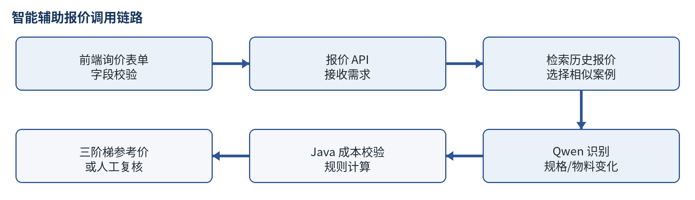
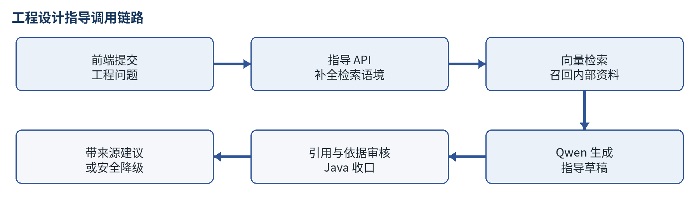
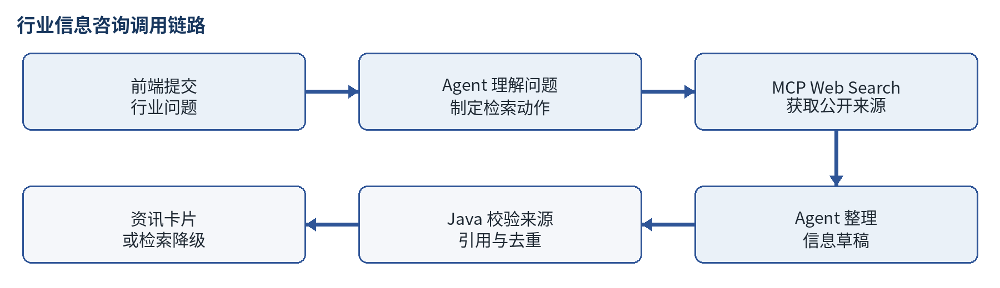

# 工业 AI 助手

**PRODUCT REQUIREMENTS DOCUMENT**

面向高速互连业务的辅助报价、工程指导与行业信息服务

|            |                                                    |
|------------|----------------------------------------------------|
| **文档项** | **内容**                                           |
| 文档版本   | V1.0                                               |
| 目标读者   | 客户代表、业务负责人、产品、研发、测试及相关协作者 |
| 产品范围   | 智能辅助报价、工程设计指导、行业信息咨询           |
| 校验日期   | 2026-08-22                                         |

> **产品摘要：**围绕高速互连业务，提供历史报价辅助、内部工程知识查询和行业信息检索三项能力，输出可追溯的工作参考。

<table>
<colgroup>
<col style="width: 33%" />
<col style="width: 33%" />
<col style="width: 33%" />
</colgroup>
<tbody>
<tr class="odd">
<td><strong>智能辅助报价</strong></td>
<td><strong>工程设计指导</strong></td>
<td><strong>行业信息咨询</strong></td>
</tr>
<tr class="even">
<td>历史报价复用 
三阶梯参考价 
关键成本复核</td>
<td>内部资料检索 
带来源排查建议 
知识沉淀复用</td>
<td>公开信息检索 
来源校验与摘要 
行业动态速览</td>
</tr>
</tbody>
</table>

# 1. 需求与产品定义

## 1.1 三类核心问题

<table>
<colgroup>
<col style="width: 17%" />
<col style="width: 37%" />
<col style="width: 45%" />
</colgroup>
<tbody>
<tr class="odd">
<td><strong>业务环节</strong></td>
<td><strong>当前工作方式</strong></td>
<td><strong>主要问题与影响</strong></td>
</tr>
<tr class="even">
<td>产品估价</td>
<td>1. 通过 OA、人工问询查询历史产品。 
2. 向工程、制造、样品人员确认制造可行性。 
3. 将物料逐项录入 K3 报价系统。 
4. 比对历史售价与当前报价。 
5. 工程主管及相关部门审批。 
6. 业务人员完成估价。</td>
<td>1. 产品种类多，历史产品检索耗时。 
2. 相似产品多，重复查询、录入和比对较多。 
3. 物料项多，人工核价容易遗漏或出错。 
4. 人工复核环节多，报价周期较长。</td>
</tr>
<tr class="odd">
<td>工程与样品指导</td>
<td>1. 样品员先尝试，关键问题由组长指导。 
2. 复杂样品由组长主导制作。 
3. 新工程师主要通过询问获取经验。 
4. 工程师按产品类别分工。 
5. 新产品通过试制和验证推进。</td>
<td>1. 培训依赖有经验人员，新员工学习周期长。 
2. 技术经验分散在个人手中，人员变动后容易流失。 
3. 现有资料以图纸和制造记录为主，部分细节难以沉淀。 
4. 工程师培养周期长，需要持续积累实践经验。 
5. 样品组长数量有限，样品员流动较大。</td>
</tr>
<tr class="even">
<td>行业信息获取</td>
<td>1. 浏览企业官网收集资料。 
2. 通过同行交流获取行业信息。 
3. 通过邮件获取企业动态。 
4. 通过展会收集市场和产品信息。</td>
<td>1. 信息来源集中于已知企业，覆盖范围有限。 
2. 行业信息分散，缺少统一入口。 
3. 信息搜索、筛选和整理耗时。 
4. 缺少持续的信息收集机制。</td>
</tr>
</tbody>
</table>

## 1.2 用户与核心任务

|                        |                                        |                                            |
|------------------------|----------------------------------------|--------------------------------------------|
| **用户**               | **核心任务**                           | **获得的价值**                             |
| 产品工程师             | 对已设计或轻微改型产品形成快速估价参考 | 减少重复填报，及时识别成本变化与复核项     |
| 业务人员               | 以工程参考价为谈判与对外报价底座       | 更快响应客户，同时保留必要的价格安全边界   |
| 样品员 / 工程师        | 查询设计、制作、测试和异常排查方法     | 缩短找资料和求助时间，复用带来源的内部知识 |
| 市场 / 业务 / 工程人员 | 了解企业、产品、技术和产业动态         | 减少公开信息搜索与整理时间                 |

## 1.3 产品目标与范围

- 输出可追溯的报价参考、工程指导和行业信息。

- 统一展示结论、依据、风险和异常状态。

- 本期不接入真实 OA/K3、审批权限、定时推送和大规模知识治理。

# 2. 智能辅助报价

> **用户与任务：**主要用户为产品工程师。产品用于已有设计或轻微改型产品的快速估价；业务人员以结果作为谈判报价的参考底座。

## 2.1 需求描述

同类询价常只调整长度、连接器或少量物料，但仍需重复查询历史报价、核对成本并填写明细。系统复用历史报价并记录物料差异，对缺价、漏项和快照异常转人工复核。

图 1 智能辅助报价从前端输入到结果展示的完整调用链路

## 2.2 核心产品需求

|          |                                                                               |
|----------|-------------------------------------------------------------------------------|
| **项目** | **需求**                                                                      |
| 输入     | 产品型号/描述、长度、制造难度（简单/中等/困难）、损耗率、当前需求与变化说明。 |
| 历史参考 | 检索相似历史报价，展示案例编码、历史物料成本和明细。                          |
| 差异识别 | 识别未变化、新增、删除、替换、数量变化和规格变化；无法确认时标记未知。        |
| 输出     | 输出 10PCS、1K、5K 三阶梯价格，以及物料变化、成本依据、风险和缺失信息。       |
| 状态     | 可直接参考、调整后参考、需要人工复核、需要补充信息。                          |

> **价格公式：**单价 =（当前物料成本 + 单件人工成本）×（1 + 损耗率）×（1 + 成本加成率）+ 非物料类单件固定费用。成本加成率：10PCS 100%，1K 40%–45%，5K 35%–40%。金额由确定性规则计算。

新增或替换物料缺价、历史快照不一致或物料无法对应时，停止自动报价并转人工复核。

# 3. 工程设计指导

> **用户与任务：**面向样品员和工程师，帮助其快速查询内部资料、获得可执行的排查顺序，并为公司持续积累可复用的技术知识。

## 3.1 需求描述

样品制作和工程排查依赖经验与带教，内部资料又分散在不同文件中。系统通过内部知识检索提供带来源的排查建议，减少重复求助，并沉淀可复用的工程知识。

图 2 工程设计指导从问题提交、知识检索到证据审核的完整调用链路

## 3.2 核心产品需求

|          |                                                                  |
|----------|------------------------------------------------------------------|
| **项目** | **需求**                                                         |
| 输入     | 产品描述、工程阶段、工程问题、已知材料/结构/测试条件或异常现象。 |
| 知识检索 | 从内部知识库召回相关片段，保留文档名、片段编号和文本证据。       |
| 指导生成 | 基于证据生成分步骤建议、原因、风险、补充信息和引用编号。         |
| 证据审核 | 引用必须真实存在；建议必须得到证据支持，否则不放行。             |
| 状态     | 分析完成、需要补充信息、无相关知识证据、需要人工复核。           |

## 3.3 使用与知识沉淀要求

- 无相关证据时不生成指导；信息不足时先补充关键条件。

- 知识文档更新后执行一次性入库，入库步骤写入项目 README。

# 4. 行业信息咨询

> **用户与任务：**面向市场、业务、工程及其他行业从业人员，快速了解高速线缆、连接器和高速互连领域的企业、产品、技术与产业动态。

## 4.1 需求描述

行业公开信息分散在企业官网、媒体和展会等渠道，人工检索和整理耗时。系统按用户问题检索公开网页并生成带来源的资讯摘要。

图 3 行业信息咨询从 Agent 检索到来源校验的完整调用链路

## 4.2 核心产品需求

|          |                                                                        |
|----------|------------------------------------------------------------------------|
| **项目** | **需求**                                                               |
| 输入     | 输入开放式行业问题，可询问企业、产品、技术、标准或产业链动态。         |
| 自主检索 | Agent 根据问题确定检索内容和关键词，通过 MCP Web Search 获取公开网页。 |
| 信息整理 | 输出标题、摘要、关键发现、来源和必要时间信息，并对重复内容去重。       |
| 来源校验 | 仅保留本次搜索返回的有效 URL；每条信息至少引用一个来源。               |
| 状态     | 信息收集完成、暂无相关信息、检索失败。                                 |

## 4.3 结果边界

- 无有效来源时不补写近期事实；搜索失败与暂无相关信息分开提示；结果仅用于行业信息参考。

# 5. 统一体验与系统边界

## 5.1 AI 介入边界

|              |             |                                        |                                            |
|--------------|-------------|----------------------------------------|--------------------------------------------|
| **模块**     | **AI 定位** | **AI 处理**                            | **系统约束**                               |
| 智能辅助报价 | 受控报价    | 理解需求，识别历史方案与当前方案差异。 | 控制成本来源、公式、价格、状态和人工复核。 |
| 工程设计指导 | 证据约束    | 基于内部证据组织排查建议。             | 控制检索门槛、引用有效性和证据一致性。     |
| 行业信息咨询 | 自主检索    | 决定检索动作并整理公开信息。           | 控制工具范围、来源、去重和失败降级。       |

## 5.2 统一交互要求

- 业务枚举、难度和状态使用中文展示；必要术语保留英文。

- 结果页先展示结论，再展示依据、风险、缺失信息和下一步操作。

- 报价标注“仅供参考”；工程指导和行业信息展示来源。

- 失败状态给出原因和下一步操作。

## 5.3 当前数据与服务边界

|               |                                    |                                        |
|---------------|------------------------------------|----------------------------------------|
| **数据/服务** | **当前方式**                       | **边界**                               |
| 历史报价      | 内置历史报价快照                   | 用于验证流程，不代表已连接真实 OA/K3。 |
| 工程知识      | 本地 Markdown + Embedding 向量文件 | 仅回答知识库覆盖内容。                 |
| 行业来源      | MCP Web Search 返回的公开网页      | 结果受搜索可用性和来源质量影响。       |

# 6. 验收标准

## 6.1 功能验收

|          |                                                        |                                                              |
|----------|--------------------------------------------------------|--------------------------------------------------------------|
| **模块** | **必须通过的场景**                                     | **预期结果**                                                 |
| 报价     | 历史一致；新增成本明确；物料缺价；无历史案例；非法难度 | 输出报价、人工复核、补充信息或字段校验；不产生无依据金额     |
| 工程指导 | 证据充分；信息不足；无相关知识；引用审核失败           | 输出带来源建议、补充问题、无证据或人工复核；不放行无依据建议 |
| 行业咨询 | 有有效来源；无相关信息；Agent/MCP 异常                 | 输出资讯、暂无相关信息或检索失败；不保留无来源发现           |
| 前端     | 三模块表单、状态映射和异常提示                         | 字段口径一致，真实调用后端，结果层级清楚                     |

## 6.2 试运行指标

|                  |                                        |                        |
|------------------|----------------------------------------|------------------------|
| **目标**         | **观察指标**                           | **说明**               |
| 提升报价响应效率 | 单次参考报价用时、人工补录字段数       | 比较使用前后变化       |
| 降低报价漏项风险 | 缺价/异常快照转人工数量                | 关注关键问题是否被拦截 |
| 提升知识复用     | 有来源建议比例、无证据降级率、采纳反馈 | 按问题类别观察         |
| 降低资讯整理成本 | 单次收集用时、有效来源数、重复信息比例 | 区分检索失败与暂无信息 |
