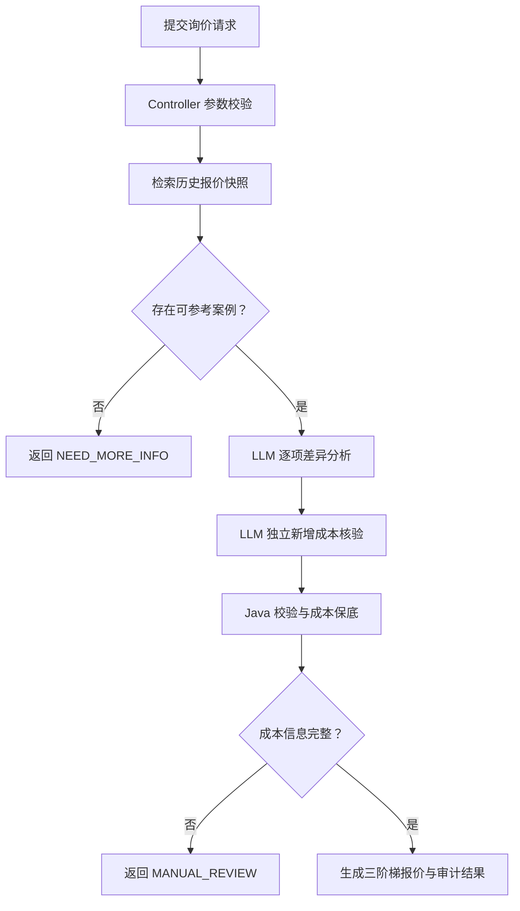

# 工业 AI 助手产品需求文档

## 第一部分：智能报价模块（作品集展示版）

| 文档项 | 内容 |
|---|---|
| 产品名称 | 工业 AI 助手 |
| 模块名称 | 智能报价模块 |
| 文档版本 | V1.0 Final |
| 产品形态 | 后端 API MVP |
| 展示目标 | 呈现工业报价场景中的产品设计、LLM 应用边界与确定性工程控制 |
| 最终归属 | 三合一最终 PRD 的第一部分 |

---

## 1. 产品背景

工业产品询价通常依赖历史报价、物料清单、生产效率和人工经验。传统处理方式存在三类典型问题：

1. 历史报价只能提供最终售价，容易通过售价反推物料成本，产生不可预测误差。
2. 新询价与历史产品之间的材料、规格和结构差异主要依赖人工逐项核对，效率低且容易漏项。
3. LLM 适合理解非结构化需求，但不适合独立承担金额计算和安全边界控制。

智能报价模块以“历史真实成本 + LLM 差异分析 + Java 确定性核算”为核心，将语义理解能力与金额安全规则分离，在保留业务可解释性的同时生成样品、小批量和量产三阶梯报价。

## 2. 产品目标

### 2.1 核心目标

- 从历史完整报价快照中直接取得物料成本，不通过历史售价反推。
- 使用 LLM 逐项比较询价产品与历史产品，识别新增、删除、替换、规格及用量变化。
- 对询价中明确声明的新增物料成本设置独立核验和最低成本线。
- 使用确定性程序完成成本、人工、损耗和利润计算。
- 在缺少价格、缺少历史案例或分析依据不足时停止自动报价并转人工复核。
- 输出完整执行步骤、成本依据和风险信息，支持前端展示与业务审计。

### 2.2 非目标

本模块定位为作品集 MVP，当前版本不包含：

- 真实 K3、ERP 或企业数据库连接；
- 审批流、权限体系和正式报价单签发；
- 所有工业品类和异常场景的穷举；
- 企业级高并发、缓存、消息队列和监控治理；
- 对模型响应速度和 Token 成本的深度优化。

演示版通过内置历史报价快照模拟 K3 查询结果，重点验证产品逻辑与 AI 全链路设计。

## 3. 目标用户与使用场景

| 用户角色 | 核心诉求 | 模块价值 |
|---|---|---|
| 产品工程师 | 快速判断新询价与历史产品的差异 | 自动生成逐项物料变化清单 |
| 报价工程师 | 获取有成本依据的报价建议 | 直接使用历史物料成本并生成三阶梯报价 |
| 业务审核人员 | 判断报价是否存在漏算或缺失信息 | 查看成本保底、风险和人工复核依据 |
| 客户或作品集评审者 | 理解 AI 如何参与真实业务流程 | 查看 LLM、工具、规则和审计链路的职责分工 |

## 4. 核心产品设计

### 4.1 历史真实成本优先

每条历史报价案例保存完整快照，包括：

- 产品型号、长度、关键词和制造难度；
- 历史生产效率、人工成本和损耗率；
- 完整物料编码、规格、数量、单价和总成本；
- 样品、小批量、量产历史价格；
- 报价版本和报价时间。

系统直接读取历史物料总成本，并校验物料明细合计是否与总成本一致。数据不一致时停止自动报价，防止错误数据进入后续计算。

### 4.2 LLM 负责语义判断

第一次 LLM 调用负责详细比较当前询价与历史报价快照，输出：

- 产品变化程度；
- 保持不变的历史物料；
- 新增、删除、替换物料；
- 用量和规格变化；
- 当前成本来源及判断证据；
- 缺失信息、可信度和人工复核标记。

LLM 不负责生产效率、利润系数和最终报价，避免自然语言推理直接控制金额结果。

### 4.3 独立新增成本核验

第二次 LLM 调用只检查询价原文中明确声明的新增物料成本，不读取第一次分析结论。

该设计用于降低单次分析漏掉“新增材料 A 5 元、材料 B 3 元”等明确成本的风险。Java 取两次分析结果中的较大新增成本作为最低成本依据。

### 4.4 Java 确定性保底

最终金额由 Java 工具计算：

```text
计算材料成本
= 历史物料总成本
- 已核验的删除物料历史成本
+ 已确认的替换或变更物料成本
+ 第一次分析识别的新增物料成本
```

```text
新增物料保底金额
= max（第一次分析新增成本，第二次独立核验新增成本）
```

```text
最终采用材料成本
= max（计算材料成本，材料成本保底线）
```

当第一次分析漏算、第二次核验识别出更高新增成本时，系统自动抬升材料成本，并记录 `materialCostFloorTriggered=true`。

## 5. 业务调用链路



### 5.1 代码职责映射

| 组件 | 主要职责 |
|---|---|
| `QuoteController` | 接收 HTTP 请求并执行参数校验 |
| `HistoricalQuoteTool` | 检索最相似历史报价快照；MVP 使用内置数据 |
| `QuoteAnalysisService` | 调用千问完成差异分析和独立新增成本核验 |
| `QuoteCalculationTool` | 校验历史成本、执行保底规则并计算三阶梯报价 |
| `QuoteAgentService` | 编排完整链路，处理正常结果和人工复核分支 |

## 6. 功能需求

### 6.1 询价输入

接口地址：

```text
POST /api/quote/generate
```

| 字段 | 必填 | 说明 |
|---|---:|---|
| `productModel` | 是 | 产品型号、内部料号或产品描述 |
| `productLengthMm` | 是 | 产品长度，单位为毫米 |
| `manufacturingDifficulty` | 是 | `EASY`、`MEDIUM`、`HARD` |
| `lossRate` | 是 | 小数形式，例如 5% 传入 `0.05` |
| `requirementDescription` | 是 | 规格、材料、结构、工艺和明确费用说明 |

### 6.2 历史案例检索

- 根据产品型号、关键词和长度计算相似度。
- 返回最多 3 条候选案例。
- 选择得分最高的案例作为报价基准。
- 历史产品状态只作为背景数据，不参与当前询价参数设计。
- 未找到案例时不调用 LLM，不生成金额。

### 6.3 物料差异分析

支持以下变化类型：

| 类型 | 含义 |
|---|---|
| `UNCHANGED` | 物料保持不变，沿用历史成本 |
| `ADD` | 新增物料 |
| `REMOVE` | 删除历史物料 |
| `REPLACE` | 替换历史物料 |
| `QUANTITY` | 物料用量变化 |
| `SPEC_CHANGE` | 物料规格变化 |
| `UNKNOWN` | 无法安全判断，转人工复核 |

### 6.4 三阶梯报价

演示版采用以下规则：

| 报价阶梯 | 利润系数 | 输出形式 |
|---|---:|---|
| 10 PCS 样品 | 2.00 | 单一价格 `samplePrice` |
| 1K 小批量 | 1.40～1.45 | 价格区间 |
| 5K 量产 | 1.35～1.40 | 价格区间 |

样品利润系数已经足够覆盖小批量风险，因此不设置无意义的上下限区间。

最终价格公式：

```text
（当前物料成本 + 单件人工成本）
×（1 + 损耗率）
× 利润系数
+ 非物料类单件固定费用
```

### 6.5 人工复核

以下情况停止自动报价：

- 新增、替换、用量或规格变化缺少当前成本；
- LLM 输出无法对应历史物料编码或历史成本；
- 用户提到新增费用但金额或单位不明确；
- 历史物料明细与物料总成本不一致；
- 模型可信度低、存在未知变化或产品变化过大。

人工复核响应保留已经完成的差异分析、物料变化、缺失信息和中止原因，但未安全完成的当前成本和最终报价保持为空。

## 7. 决策状态

| 决策状态 | 触发条件 | 产品行为 |
|---|---|---|
| `DIRECT_REFERENCE` | 当前产品与历史案例无实质变化 | 使用历史真实成本生成报价 |
| `ADJUSTED_REFERENCE` | 存在已确认成本的物料变化 | 调整历史成本后生成报价 |
| `MANUAL_REVIEW` | 成本缺失、证据不足或分析存在风险 | 保留中间结果，停止金额输出 |
| `NEED_MORE_INFO` | 没有可参考历史案例 | 要求补充历史报价和物料成本依据 |

## 8. 核心输出

报价结果主要包含：

- 最终决策和摘要；
- 参考历史报价完整快照；
- 产品变化程度、原因和逐项物料变化；
- 历史材料成本、当前材料成本和最低成本线；
- 已确认新增物料成本及保底触发状态；
- 生产效率、人工成本和三阶梯报价；
- 风险、缺失信息和人工复核建议；
- Agent 执行步骤和完整分析报告。

## 9. 关键产品决策

| 产品问题 | 设计选择 | 设计原因 |
|---|---|---|
| 历史成本如何取得 | 读取完整历史报价快照 | 避免从售价反推成本造成误差 |
| 产品差异由谁判断 | LLM | 适合处理非结构化规格和语义差异 |
| 金额由谁计算 | Java | 确定性、可测试、可审计 |
| 明确新增成本如何防漏 | 第二次独立核验 + Java 最低成本线 | 降低单次模型漏算风险 |
| 缺少价格时如何处理 | 转人工复核 | 不允许模型猜测企业成本 |
| 无历史案例如何处理 | 停止报价且不调用 LLM | 没有成本锚点时避免无依据生成 |
| 样品价是否设置区间 | 使用固定单值 | 样品利润系数较高，重复上下限无业务价值 |

## 10. MVP 验收结果

| 验收场景 | 预期结果 | 状态 |
|---|---|---:|
| 产品与历史案例完全一致 | 直接使用 36 元历史物料成本 | 通过 |
| 明确新增 5 元和 3 元物料 | 最低材料成本提升至 44 元 | 通过 |
| 新增物料但没有价格 | 转人工复核，不生成报价 | 通过 |
| 没有可参考历史案例 | 返回补充信息，不调用 LLM | 通过 |
| 第一次分析漏算新增成本 | Java 触发保底并抬升成本 | 单元测试通过 |
| K3 总成本与物料明细不一致 | 拒绝自动报价 | 单元测试通过 |

默认 Maven 测试只运行纯 Java 回归测试，不调用千问、Embedding 或 MCP。外部模型测试必须显式启用集成测试配置，避免日常构建产生 Token 消耗。

## 11. 演示路径

建议按以下顺序展示：

1. 展示完整历史报价快照，说明物料成本来自历史记录而非售价反推。
2. 提交完全一致的产品，展示直接参考报价。
3. 增加两项明确物料费用，展示 LLM 差异分析和成本由 36 元提升至 44 元。
4. 提交缺少价格的新增物料，展示系统停止自动报价并保留人工复核依据。
5. 提交无历史案例的新产品，展示系统不调用 LLM、不生成无依据价格。
6. 展示纯 Java 单元测试，说明成本保底规则可重复验证且不消耗 Token。

## 12. 模块完成标准

智能报价模块达到作品集 MVP 完成标准，后续不继续枚举低频业务场景，也不进行企业级数据库、审批流和性能治理扩展。

只有出现以下情况时才重新进入开发：

1. 存在可能导致物料成本漏算或低报价的问题；
2. 核心演示链路无法运行；
3. 影响最终三合一产品的统一交互或接口整合。

其余优化项统一记录为后续设想，不影响当前模块完成状态。

---

## 13. 最终 PRD 合并说明

本文件作为三合一最终 PRD 的第一部分保存。后续文档将继续补充：

1. 工程设计指导模块 PRD；
2. 行业资讯收集模块 PRD；
3. 三个模块之间的统一入口、用户路径与产品价值总结。

